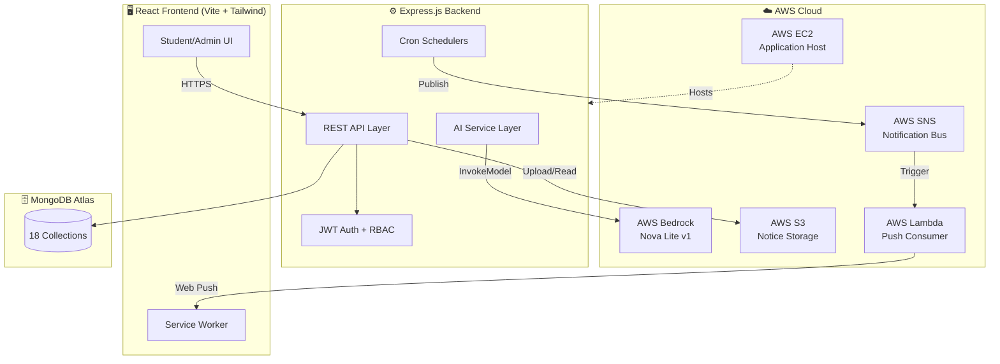

<div align="center">

# 🎓 CampusFlow

### The AI Operating System for Student Life

*Transforming campus communication, academic planning, and student wellness through intelligent automation.*

[](https://aws.amazon.com)
[](https://react.dev)
[](https://nodejs.org)
[](https://mongodb.com)
[](https://aws.amazon.com/bedrock/)
[](http://54.159.36.107:4000/login)

---

### 🚀 [Live Demo → http://54.159.36.107:4000/login](http://54.159.36.107:4000/login)

**Student Login:** `student@campusflow.com` / `student123`  
**Admin Login:** `admin@campusflow.com` / `admin123`

---

</div>

## 🌍 Vision

Every semester, students across Indian colleges navigate a maze of WhatsApp groups, scattered notice boards, unofficial Telegram channels, and outdated portals — just to find out when their next exam is. Administrative notices go unread. Deadlines slip by. Study time evaporates into scheduling chaos.

**CampusFlow reimagines the campus as a connected digital ecosystem** where every notice, deadline, event, and study session flows through a single intelligent layer — powered by AI that doesn't just inform students, but actively helps them succeed.

We didn't build another LMS. We built the operating system for student life.

---

## 🔥 The Problem

<table>
<tr>
<td width="25%" align="center">

**📢 Fragmented Notices**

Campus announcements scattered across 5+ platforms. Students miss critical registration deadlines.

</td>
<td width="25%" align="center">

**⏰ Missed Deadlines**

No proactive system exists. Students discover they missed submissions after the fact.

</td>
<td width="25%" align="center">

**📋 Manual Scheduling**

Students spend hours building study plans that break the moment one class gets rescheduled.

</td>
<td width="25%" align="center">

**🧠 Burnout Epidemic**

No visibility into workload balance. Students push through until they crash.

</td>
</tr>
</table>

> **The reality:** A single missed notice about a placement drive can cost a student their career opportunity. A forgotten exam deadline means a semester repeat. These aren't edge cases — they're Tuesday.

---

## 💡 Our Solution

CampusFlow is a **full-stack intelligent campus assistant** that:

🔔 **Centralizes** — Every notice, deadline, and event in one place with AI-generated summaries  
⚡ **Automates** — Proactive 72h, 24h, and 1h deadline reminders with browser push notifications  
🧠 **Optimizes** — AI-powered study plan generation that respects your sleep, meals, and exam priorities  
🛡️ **Protects** — Guardian AI that scans your week, detects burnout risk, and suggests course corrections  
🌱 **Nurtures** — Focus sessions, habit tracking, wellness logging, and expense management in one companion  

This isn't a dashboard that shows you data. It's a system that **acts on your behalf**.

---

## ⚔️ Why CampusFlow is Different

| | Traditional Campus Systems | CampusFlow |
|---|---|---|
| **Notices** | Static PDFs on a website | AI-summarized with urgency classification and deadline extraction |
| **Reminders** | None (students rely on memory) | Automated 72h → 24h → 1h cascade with push notifications |
| **Scheduling** | Manual timetable in spreadsheet | AI that detects conflicts, suggests study blocks, and adapts daily |
| **Wellness** | Non-existent | Mood tracking, burnout detection, habit streaks, and AI advice |
| **Communication** | One-way (admin → student) | Two-way with intelligent chatbot and personalized recommendations |
| **Intelligence** | Zero | Guardian AI that proactively identifies risks before they become problems |

---

## ✨ Key Features

### 🎒 Student Experience

| Feature | Description |
|---------|-------------|
| **Personalized Dashboard** | Unified view of today's schedule, upcoming deadlines, and AI-generated insights |
| **Smart Calendar** | Week/month views with conflict detection and color-coded event types |
| **Notice Intelligence** | AI-summarized notices with urgency badges, category tags, and extracted deadlines |
| **Notification Center** | Severity-ranked alerts with mark-as-read, filtering, and unread badge |
| **AI Study Planner** | Generates time-blocked study sessions based on exam dates and available hours |
| **Guardian AI** | Weekly risk analysis identifying missed prep, attendance drops, and overload |
| **Academic Chatbot** | Context-aware conversational assistant for academic queries |
| **Smart Scheduler** | Detects timeline overlaps, suggests optimal study windows, and tracks attendance recovery |
| **Focus Zone** | Pomodoro-style focus sessions with streak tracking and inventory rewards |
| **Life Companion** | Wellness logs, habit tracking, expense management, burnout monitoring, and AI recommendations |
| **Routine Intelligence** | Analyzes daily patterns and suggests routine improvements |

### 🏫 Administrator Experience

| Feature | Description |
|---------|-------------|
| **Notice Upload** | Drag-and-drop PDF/image/text upload with automatic AI processing |
| **Previous Notices** | Full history view with sort, search, and permanent deletion |
| **AI Summarization** | Automatic extraction of title, summary, urgency, deadlines, and action items |
| **Student Reach** | Every uploaded notice instantly visible to all students with push alerts |

---

## 🏗️ System Architecture



---

## ☁️ AWS Innovation

| AWS Service | How We Use It | Impact |
|---|---|---|
| **AWS Bedrock** (Nova Lite) | Notice summarization, study plan generation, chatbot responses, Guardian AI analysis, scheduling optimization, routine intelligence, burnout assessment | Replaces 7 separate AI workflows with one managed service |
| **AWS SNS** | Event bus for critical/high-severity notifications | Decouples notification creation from delivery — system never blocks |
| **AWS Lambda** | Serverless push notification consumer | Scales to zero cost when idle, handles burst notification events |
| **AWS S3** | Secure notice file storage with pre-signed URLs | Files never publicly accessible; 15-minute expiring read URLs |
| **AWS EC2** | Application deployment | Full-stack hosting with production-ready configuration |

**Why AWS Bedrock matters:** A single `InvokeModel` call powers notice intelligence, study planning, academic chat, risk analysis, scheduling optimization, and wellness recommendations. We built 7 AI features without managing a single ML model.

---

## 🗺️ User Journey

```
┌─────────────┐     ┌──────────────────┐     ┌─────────────────┐
│   Student    │────▶│  Smart Dashboard  │────▶│  AI Study Plan   │
│   Logs In    │     │  Today's Overview  │     │  Time-Blocked    │
└─────────────┘     └──────────────────┘     └─────────────────┘
                            │                         │
                            ▼                         ▼
                    ┌──────────────────┐     ┌─────────────────┐
                    │  Notice Center    │     │  Focus Sessions   │
                    │  AI Summaries     │     │  Deep Work Mode   │
                    └──────────────────┘     └─────────────────┘
                            │                         │
                            ▼                         ▼
                    ┌──────────────────┐     ┌─────────────────┐
                    │  Guardian AI      │     │  Life Companion   │
                    │  Risk Alerts      │     │  Wellness + $$$   │
                    └──────────────────┘     └─────────────────┘
```

---

## 🛠️ Technology Stack

| Layer | Technology | Version |
|-------|-----------|---------|
| **Frontend** | React | 19.2 |
| **Build Tool** | Vite | 8.0 |
| **Styling** | Tailwind CSS | 3.4 |
| **Routing** | React Router | 7.17 |
| **HTTP Client** | Axios | 1.17 |
| **Backend** | Express.js | 5.2 |
| **Runtime** | Node.js | 20 LTS |
| **Database** | MongoDB (Mongoose 9.7) | Atlas |
| **AI/ML** | AWS Bedrock (Nova Lite v1) | — |
| **Storage** | AWS S3 | — |
| **Notifications** | AWS SNS + Lambda | — |
| **Auth** | JWT + bcrypt (cost 12) | — |
| **Scheduling** | node-cron | 4.2 |
| **Push** | Web Push (VAPID) | 3.6 |
| **PDF Processing** | pdf-parse | 2.4 |
| **Deployment** | AWS EC2 | — |

---

## 📸 Screenshots

| Login | Student Dashboard |
|-------|------------------|
|  |  |

| Notice Intelligence | Smart Scheduler |
|---------------------|-----------------|
|  |  |

| Life Companion | Focus Zone |
|----------------|------------|
|  |  |

---

## 📡 API Overview

### Authentication
| Method | Endpoint | Description |
|--------|----------|-------------|
| POST | `/api/auth/register` | Student registration |
| POST | `/api/auth/login` | Login (returns JWT) |

### Notices
| Method | Endpoint | Description |
|--------|----------|-------------|
| POST | `/api/notices` | Upload notice (admin) |
| GET | `/api/notices` | List notices (paginated, urgency-sorted) |
| GET | `/api/notices/:id` | Notice detail + pre-signed file URL |
| GET | `/api/notices/admin/history` | Admin notice history with sorting |
| DELETE | `/api/notices/:id` | Delete notice (admin) |

### Events & Calendar
| Method | Endpoint | Description |
|--------|----------|-------------|
| GET | `/api/events` | List student events |
| POST | `/api/events` | Create event |
| PUT | `/api/events/:id` | Update event |
| DELETE | `/api/events/:id` | Delete event |

### AI Services
| Method | Endpoint | Description |
|--------|----------|-------------|
| POST | `/api/studyplans/generate` | AI study plan generation |
| POST | `/api/chat` | Academic chatbot |
| POST | `/api/guardian/analyze` | Guardian AI risk analysis |
| GET | `/api/scheduling/analyze` | Smart scheduling analysis |
| POST | `/api/scheduling/optimize` | AI schedule optimization |

### Notifications
| Method | Endpoint | Description |
|--------|----------|-------------|
| GET | `/api/notifications` | List notifications (paginated) |
| GET | `/api/notifications/unread-count` | Unread badge count |
| PATCH | `/api/notifications/:id/read` | Mark as read |
| PATCH | `/api/notifications/read-all` | Mark all as read |

### Life Companion
| Method | Endpoint | Description |
|--------|----------|-------------|
| GET | `/api/life-companion/dashboard` | Full companion dashboard data |
| POST | `/api/life-companion/wellness` | Log wellness metrics |
| POST | `/api/life-companion/expense` | Add expense |
| POST | `/api/life-companion/habits` | Toggle daily habit |

### Additional Modules
| Method | Endpoint | Description |
|--------|----------|-------------|
| GET | `/api/attendance` | Attendance records |
| GET | `/api/focus/sessions` | Focus session history |
| POST | `/api/focus/sessions` | Start focus session |
| GET | `/api/routine/analyze` | Routine intelligence |
| POST | `/api/push/subscribe` | Register push subscription |

---

## 📁 Project Structure

```
CampusFlow/
├── client/                     # React Frontend
│   ├── src/
│   │   ├── api/                # Axios client configuration
│   │   ├── components/         # Reusable UI components
│   │   │   ├── Sidebar.jsx
│   │   │   ├── ProtectedRoute.jsx
│   │   │   ├── NotificationBanner.jsx
│   │   │   └── EventModal.jsx
│   │   ├── context/            # React Context providers
│   │   │   ├── AuthContext.jsx
│   │   │   ├── NotificationContext.jsx
│   │   │   ├── ThemeContext.jsx
│   │   │   └── ToastContext.jsx
│   │   ├── pages/              # Route-level page components
│   │   │   ├── DashboardPage.jsx
│   │   │   ├── CalendarPage.jsx
│   │   │   ├── NoticesPage.jsx
│   │   │   ├── NotificationsPage.jsx
│   │   │   ├── StudyPlanPage.jsx
│   │   │   ├── ChatPage.jsx
│   │   │   ├── AttendancePage.jsx
│   │   │   ├── SchedulingPage.jsx
│   │   │   ├── FocusZonePage.jsx
│   │   │   ├── LifeCompanionPage.jsx
│   │   │   ├── RoutinePage.jsx
│   │   │   ├── AdminPage.jsx
│   │   │   └── PreviousNoticesPage.jsx
│   │   ├── hooks/              # Custom React hooks
│   │   ├── App.jsx             # Root component + routing
│   │   └── index.css           # Tailwind + custom styles
│   ├── public/
│   │   └── sw.js               # Service Worker (push notifications)
│   └── vite.config.js
│
├── server/                     # Express.js Backend
│   ├── src/
│   │   ├── config/             # DB and AWS configuration
│   │   ├── middleware/         # JWT auth + role guards
│   │   ├── models/             # 18 Mongoose schemas
│   │   ├── routes/             # 14 route modules
│   │   ├── services/           # Business logic layer
│   │   │   ├── bedrock.service.js    # AI (7 features)
│   │   │   ├── s3.service.js         # File storage
│   │   │   ├── sns.service.js        # Push notifications
│   │   │   ├── summarize.service.js  # Notice AI pipeline
│   │   │   └── reminder.scheduler.js # Cron jobs
│   │   ├── scripts/            # Database seeding
│   │   └── index.js            # Express app entry point
│   └── Dockerfile
│
├── lambda/                     # AWS Lambda Functions
│   └── push-consumer/          # SNS → Web Push delivery
│
├── docs/                       # Deployment documentation
│   ├── deployment.md
│   ├── architecture.md
│   ├── aws-setup.md
│   └── deployment-checklist.md
│
├── amplify.yml                 # AWS Amplify build config
└── .github/workflows/          # CI/CD pipeline
    └── deploy.yml
```

---

## 🚀 Installation

### Prerequisites

- Node.js 20+
- MongoDB Atlas account (or local MongoDB)
- AWS Account (for Bedrock, S3, SNS)

### Quick Start

```bash
# Clone the repository
git clone https://github.com/aayushshekhawat123/Campus_Flow.git
cd Campus_Flow

# Backend setup
cd server
npm install
cp .env.example .env    # Configure your environment variables
npm run dev             # Starts on port 4000

# Frontend setup (new terminal)
cd client
npm install
npm run dev             # Starts on port 5173
```

### Environment Variables

Create `server/.env`:

```env
NODE_ENV=development
PORT=4000
MONGODB_URI=mongodb+srv://<user>:<pass>@<cluster>.mongodb.net/campusflow
JWT_SECRET=<your-secret-key>
AWS_REGION=us-east-1
AWS_ACCESS_KEY_ID=<your-key>
AWS_SECRET_ACCESS_KEY=<your-secret>
S3_BUCKET_NAME=campusflow-notices
SNS_TOPIC_ARN=arn:aws:sns:us-east-1:<account>:Campus_Flow_Notification
BEDROCK_MODEL_ID=amazon.nova-lite-v1:0
VAPID_PUBLIC_KEY=<your-vapid-public>
VAPID_PRIVATE_KEY=<your-vapid-private>
VAPID_EMAIL=mailto:admin@campusflow.com
```

---

## 🔒 Security

| Layer | Implementation |
|-------|---------------|
| **Authentication** | JWT tokens with 8-hour expiry |
| **Password Storage** | bcrypt with cost factor 12 |
| **Role-Based Access** | `student` / `administrator` role guards on every route |
| **API Protection** | All endpoints require valid JWT (except login/register) |
| **File Access** | S3 objects private; 15-minute pre-signed URLs for reads |
| **Input Validation** | Joi schemas on all request bodies |
| **XSS Prevention** | DOMPurify on client-side rendering |
| **CORS** | Strict origin allowlist |
| **Secrets** | Environment variables, never committed to repository |

---

## 📈 Scalability

CampusFlow's architecture is built for growth:

- **Stateless API** — App Runner / EC2 can scale horizontally behind a load balancer
- **MongoDB Atlas** — Auto-scales with read replicas and sharding
- **S3** — Infinite storage, zero maintenance
- **Lambda** — Push delivery scales automatically with notification volume
- **Bedrock** — Managed AI with no infrastructure to maintain
- **Service Worker** — Push notifications work even when the app is closed

**Future expansion paths:**
- Multi-tenant architecture for multiple colleges
- Mobile app (React Native) sharing the same API
- Real-time WebSocket updates for instant notification delivery
- Analytics pipeline for institutional insights

---

## 🗓️ Roadmap

| Phase | Milestone | Status |
|-------|-----------|--------|
| **Phase 1** | CampusFlow MVP — Notices, Calendar, Reminders, AI Study Plans, Guardian AI, Push Notifications | ✅ Complete |
| **Phase 2** | Life Companion — Wellness, Expenses, Habits, Burnout Detection, Focus Zone, Routine Intelligence | ✅ Complete |
| **Phase 3** | Smart Scheduler — AI conflict resolution, attendance recovery, workload balancing | ✅ Complete |
| **Phase 4** | Cross-Campus Collaboration — Multi-institution support, shared event calendars | 🔮 Planned |
| **Phase 5** | Predictive Analytics — Grade prediction, dropout risk scoring, placement readiness | 🔮 Planned |

---

## 💥 Impact

<table>
<tr>
<td align="center" width="25%">

**📊 11 Modules**

Complete student life coverage in one platform

</td>
<td align="center" width="25%">

**🤖 7 AI Features**

Powered by a single Bedrock integration

</td>
<td align="center" width="25%">

**⚡ 40+ API Endpoints**

Production-ready REST architecture

</td>
<td align="center" width="25%">

**🔔 3-Layer Alerts**

72h → 24h → 1h proactive reminders

</td>
</tr>
</table>

---

<div align="center">

### CampusFlow is not a campus management tool.

### It's the foundation of a smarter, more connected academic future — where no student misses a deadline, no notice goes unread, and every hour of study time is optimized by AI that genuinely understands their academic life.

---

**Built with ❤️ for the AWS Hackathon**

[🚀 Try the Live Demo](http://54.159.36.107:4000/login) · [📖 Deployment Guide](docs/deployment.md) · [🏗️ Architecture](docs/architecture.md)

</div>
